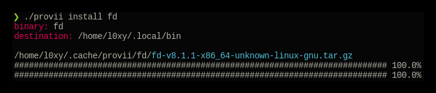
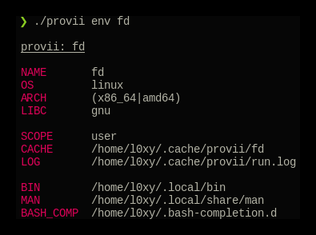
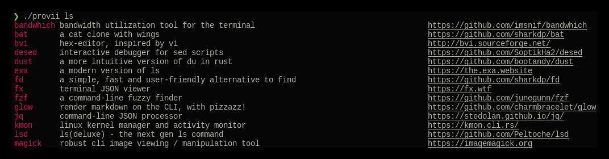
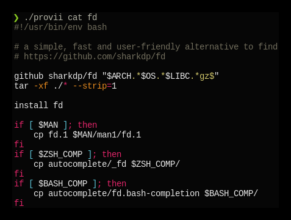

= provii

++++

  

++++

`provii` is a provisioning tool to painlessly download your favorite command-line utilities as pre-compiled binaries on a machine that that may be missing them. It is a convenient alternative when you do not have the premissions required to install software using the systems package manager or when you do not wish to install the software system-wide.

The script itself is hosted at both at link:https://cdn.spencersmolen.com/provii and at link:https://raw.github.com/kriipke/provii/master/provii[]. Additionally, the list of installers available via `provii` can be found at link:https://github.com/kriipke/provii/tree/master/installs[here] (or listed using `provii` itself, see <<provii ls,`provii ls`>>)

`provii` works by gathering the necessary information about the system its running on to install the pre-built binary (as well as man pages & shell completions if available), and then fetching & running the appropriate installion scripts hosted in provii's github repository in the link:https://github.com/kriipke/provii/tree/master/installs[installs directory].

When gathering facts, provii intelligently determines the relevant settings based on, most imporarntly, whether it was run with root privilages or not along with things like operating system, processor type & installed version of `libc`.

For example, during a typical install of `fd`, an alternative to the `find` tool written in Rust, if the default settings are used, provii would install the following files:

. `fd` binary
. `fd` man page
. `fd` shell completions

For more information on where these files are installed and how that location is determined see <<Environment>> and <<How provii works,How `provii` works>> below.

[NOTE]
====
All the softwares installed via provii come *directly from their authors*, e.g. the official Github repository or the official SourceForge page. So you can feel as safe installing all these softwares using provii as you would going to the project's home page and downloading them yourself.
====

The goal of provii is to save you the 5-6 steps you would typically have to take to download the most recent release from the author, unarchive it, and copy the binary & man pages / shell completions to the right folders. In other words, provii is designed to do exactly what _you_ would do, but automated.

If you would like to add your piece of software to the list of installers avaliable via provii, either make a pull request or contact me.

== Usage

=== Method 1: curl `provii` directly into bash

The simplest way to use provii is to curl the script directly into bash. For example, to download the tool `fd`, you would simply run:

[source,bash]
bash -c "$( curl https://cdn.spencersmolen.com/provii )" fd

Once run, provii will print out the location to which the binary will be installed and print some information as the script runs. See <<provii install,`provii install`>> for output.

The best part about running provii this way is that after the installation of a program such as `fd`, _the only files left on your machine will be the ones you requested_. In other words, when provii is run by downloading via `curl`/`wget` and piped directly into `bash`, there will be no trace of provii itself or any intermediary files used during the installation!

=== Method 2: download `provii` and place in `$PATH`

If you choose to download provii you will be afforded a few more features, mostly geared towards previewing the changes that will be made before running an installation. Once downloaded, the subcommands below will be available.

==== `provii install`

The `install` subcommand is the crux of provii as this is how you install the command-line utilities available via provii. Note that when you use provii using <<Method 1: curl `provii` directly into bash,method 1>>, interally provii just runs this command. Example output of `provii install fd`:

For more information, run `provii install -h`.

==== `provii env`

The `env` subcommand takes an optional argument, an installer name, and is meant to gather facts and define variables that _would be used_ in the provii installer provided. For example, if `provii env fd` was run as root it would produce output that would look something like the following:

For more information, run `provii env -h`.

==== `provii ls`

The `ls` subcommand allows you to print all the command-line tools avaliable for installation via provii. Example output:

For more information, run `provii ls -h`.

[NOTE]
Alternatively, you can browse the installers avaliable using your browser at https://github.com/kriipke/provii/tree/master/installs

==== `provii cat`

The `cat` subcommand takes the name of an installer as an argument and prints the actual script that will be run without running it. Example output of `provii cat fd`:

Note that unless you are writing a provii installer yourself or are doing debugging, you really don't need to know anything about the script or how it works unless you just want to make sure you're not running anything malicious.

For more information, run `provii cat -h`.

== How `provii` works

The script runs through the following steps to install a piece of software:

. determining whether it is being run with root privilages or not and subsequently setting the variable `$PROVII_SCOPE`, which will either be defined as `system` or `user`
. gathering information about directories to place binary files, man pages, and shell completions based on `$PROVII_SCOPE`
. gathering information about the current system running provii needed to select and install the correct binary, including this like processor type and operating system
. next, provii creates a `bash` subshell with a clean environment and populates that environment with variables that will be used while running the installation, defined during steps 1, 2 & 3 - for more information on what these varaibles are and how they are used see <<Environment>>.
. finally, within the newly created subshell provii runs the requested installer that has been fetched from the provii Github repository in the link:https://github.com/kriipke/provii/tree/master/installs[installs directory].

== Environment

This section explains all the varaibles that exists in the subshells in which the provii installers are run and how they are defined. This information is of particular interest to those who wish to modify the way that provii works or those who wish to contribute an installer script of their own to the project.

All of the variables listed in <<Environment>> below are the names of the variables as they are used in the provii script itself. These variables are _then_ used to populate the environment of the subshell in which the installer is run under different names. So, for example, when run as root the value assigned to `$PROVII_SYSTEM_BIN` will be avaliable in the installer subshell via `$BIN`. Likewise, if provii is run as a regular user the value assigned to `$PROVII_USER_BIN` will be avaliable via `$BIN`.

These variables are redefined by new names in the subshell  for two reasons:

. so that the installer scripts can be written without any regard to whether they will be run with root privilages or not, while at the same time allowing for provii to be intricately configured in the `proviirc`
. so that any exported varaibles in the shell from which provii is run, e.g. exported varaibles in the environment of the shell in which you run `./provii ...` do not interfere with the operation of provii. For example, if provii did not do this and you had an environment variable named `$BIN`, provii will use that variable as the default install destination for binary files which could cause unintended consequences.

Below is a list of all the varaibles avaliable within the subshells (and consequently the installer scripts) along with how they are defined in their parent shell, e.g. the main provii script before the subshell is entered.

[NOTE]
Variables defined in a `proviirc` file, should one exist on the machine, will not be set according to the logic below, but rather retain the value defined in the `proviirc` file (assuming that value is not null), see <<Configuration>> for more information.

[cols="m,d",options="header"]
|===
|variable
|definition logic

|$SCOPE
a|
. output of `id -u` determines value of `$PROVII_SCOPE`
. when passed to subshell, `$PROVII_SCOPE` -> `$SCOPE`

|$OS
a|
. output of `uname -s` determines value of `$PROVII_SYSTEM`
. when passed to subshell, `PRVOII_SYSTEM` -> `$OS`

|$ARCH
a|
. output of `uname -m` determines value of `$PROVII_MACHINE`
. when passed to subshell, `PRVOII_MACHINE` -> `$ARCH`

|$LIBC
a|
. output of `ldd --version` determines value of `$PROVII_LIBC`
. when passed to subshell, `$PROVII_LIBC` -> `$LIBC`

|$CACHE
a|
. hard-coded, `PROVII_CACHE=~/.cache/provii`
. when passed to subshell, `$PROVII_CACHE` -> `$CACHE`

|$LOG
a|
. hard-coded, `PROVII_LOG=$PROVII_CACHE/run.log`
. when passed to subshell, `$PROVII_LOG` -> `$LOG`

|$BIN
a|
. value of `$PROVII_BIN` set
.. _when run as root_, `PROVII_BIN=/usr/local/bin`
.. _when run as regular user_, `PROVII_BIN=~/.local/bin`
. when passed to subshell, `$PROVII_BIN` -> `$BIN`

|$MAN
a|
. value of `$PROVII_MAN` set
.. _when run as root_
... if `/usr/share/man` listed in output of `manpath`, then `/usr/share/man` -> `$PROVII_MAN`
... elif, first directory listed in the output of `manpath` -> `$PROVII_MAN`
... else, `$PROVII_MAN` remains unset
.. _regular user_
... if `~/.local/share/man` listed in output of `manpath`, then `~/.local/share/man` -> `$PROVII_MAN`
... elif, first directory listed in the output of `manpath` prefixed with `$HOME` -> `$PROVII_MAN`
... else, `$PROVII_MAN` remains unset
. when passed to subshell, _if `$PROVII_MAN` was set_ `$PROVII_MAN` -> `$MAN`

|$ZSH_COMP
a|
. value of `$PROVII_ZSH_COMP` set
.. _when run as root_
... if first directory contained in the value of `$fpath` containing `completion` prefixed with `/usr` or `/etc` -> `$PROVII_ZSH_COMP`
... elif, first directory contained in the value of `$fpath` containing `custom` prefixed with `/usr` or `/etc` -> `$PROVII_ZSH_COMP`
... else, `$PROVII_ZSH_COMP` remains unset
.. _when run as regular user_
... if first directory contained in the value of `$fpath` containing `completion` prefixed with `$HOME` -> `$PROVII_ZSH_COMP`
... elif, first directory contained in the value of `$fpath` containing `custom` prefixed with `$HOME` -> `$PROVII_ZSH_COMP`
... else, `$PROVII_ZSH_COMP` remains unset
. when passed to subshell,  _if `$PROVII_ZSH_COMP` was set_ `$PROVII_ZSH_COMP` -> `$ZSH_COMP`

|$BASH_COMP
a|
. value of `$PROVII_BASH_COMP` set
.. _when run as root_, `PROVII_BASH_COMP=/etc/bash_completion.d`
.. _when run as regular user_
... when `bash-completion` version >= 2.9, `PROVII_BASH_COMP=~/bash-completion.d`
... when `bash-completion` version < 2.9, `PROVII_BASH_COMP=${XDG_DATA_HOME:-$HOME/.local/share}/bash-completion.d`
. when passed to subshell, `$PROVII_BASH_COMP` -> `$BASH_COMP`
|===

== Configuration

If you wish to change the default operation of provii as explained in the <<Environment>> section, you may explicitly define the value of the variables that dictate the operation of provii in a `proviirc` file. `provii` will check for a configuration file containing variable definitions in the following locations:

- `$XDG_CONFIG_HOME/proviirc`, if `$XDG_CONFIG_HOME` is defined
- `$HOME/.config/proviirc` otherwise

Below is a sample configuration file with all of the possible variables and their default values. Variables without values listed below do not have a hard-coded default value but rather, their value is dynamically determined at runtime unless they are explicitly defined in the configuration file. For more information see <<Environment>>.

[NOTE]
The `proviirc` can contain as few or as many variables as you wish. However, it would only make sense to explictly define a variable in `proviirc` if you wish to override the default value as determined by the logic explained in the  <<Environment>> section.

[source]
----
# Sample ~/.config/proviirc with default values
# variables without values have values that are dynamically determined at runtime,
# unless they are explicitly defined in the proviirc, in which case that value is used

PROVII_CACHE=~/.cache/provii
PROVII_LOG=$PROVII_CACHE/run.log

PROVII_SCOPE=
PROVII_ARCH=
PROVII_OS=
PROVII_LIBC=

# variables used when $PROVII_SCOPE == system

PROVII_SYSTEM_BIN=/usr/local/bin
PROVII_SYSTEM_MAN=/usr/share/man
PROVII_SYSTEM_ZSH_COMP=
PROVII_SYSTEM_BASH_COMP=/etc/bash_completion.d

# variables used when $PROVII_SCOPE == user

PROVII_USER_BIN=~/.local/bin
PROVII_USER_MAN=~/.local/share/man
PROVII_USER_ZSH_COMP=
PROVII_USER_BASH_COMP=
----
